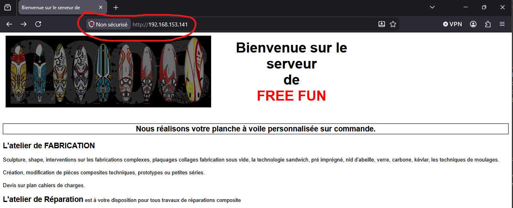
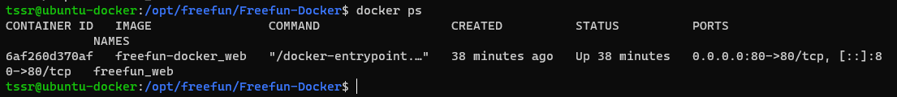
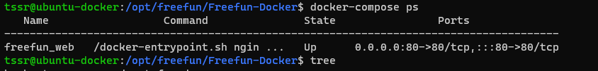

# 🚀 Déploiement d’un site web avec Docker et Nginx

<p align="center">
  
  
  
  
</p>

---

## 📌 Contexte

La société FreeFun souhaite déployer son site web dans un environnement conteneurisé.
L’objectif de ce projet est de simuler ce déploiement à l’aide de Docker sur une machine virtuelle Linux.

---

## 🧠 Choix techniques et réflexion

### 🖥️ Choix de l’OS : Ubuntu Server minimal

**Pourquoi :**

* système léger → optimisation des ressources
* environnement proche d’un serveur réel
* installation uniquement des services nécessaires

---

### 🐳 Choix de Docker

**Pourquoi :**

* déploiement rapide et simplifié
* isolation des services
* reproductibilité de l’environnement
* standard largement utilisé en entreprise

---

### 🌐 Choix de Nginx

**Pourquoi :**

* serveur web léger et performant
* adapté aux sites statiques
* très utilisé en production

---

### 🧱 Utilisation d’un Dockerfile

**Pourquoi :**

* intégrer directement le site dans l’image
* rendre le projet portable
* éviter les dépendances au système hôte

---

### ⚙️ Utilisation de Docker Compose

**Pourquoi :**

* automatiser le déploiement
* simplifier les commandes
* garantir une exécution reproductible

---

### 📁 Organisation du projet

Le projet est structuré de manière claire :

* `site/` → fichiers du site web
* `Dockerfile` → construction de l’image
* `docker-compose.yml` → orchestration

**Objectif :**

* lisibilité
* maintenance facilitée
* approche professionnelle

---

## ⚙️ Déploiement

### 📥 Cloner le projet

```bash
git clone https://github.com/TON_USER/freefun-docker.git
cd freefun-docker
```

---

### 🚀 Lancer le service

```bash
docker-compose up -d --build
```

---

## 🌐 Accès au site

Le site est accessible via l’adresse IP de la machine virtuelle :

```
http://IP_DE_LA_VM
```

---

## 📁 Structure du projet

```
freefun-docker/
├── site/
├── Dockerfile
├── docker-compose.yml
└── README.md
```

---

## 📸 Preuve de fonctionnement

### 🌐 Site en ligne


### 🐳 Conteneur actif


### ⚙️ Docker Compose


---

## ⚠️ Problèmes rencontrés

* 🔧 Problème de résolution DNS lors de l’installation
* 📦 Outils absents sur Ubuntu minimal (ping, nano)
* 🔀 Différence entre `docker compose` et `docker-compose`

---

## 🧠 Conclusion

Ce projet m’a permis de comprendre le fonctionnement de Docker et de la conteneurisation.
J’ai pu mettre en place un environnement proche d’un cas réel en entreprise, en automatisant le déploiement d’un site web.

L’utilisation de Docker Compose permet de simplifier les manipulations et de garantir un déploiement rapide, reproductible et maintenable.

---

## 👨‍💻 Auteur

Projet réalisé dans le cadre de la formation TSSR
